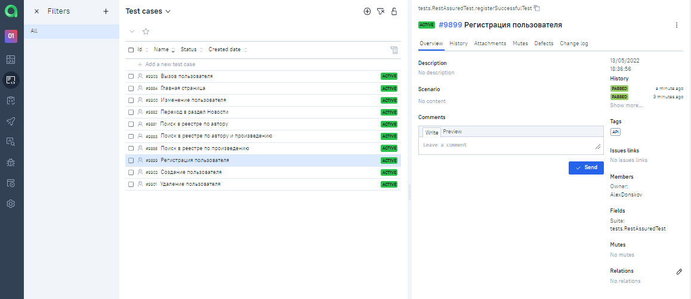

# Проект по автоматизации тестирования сайта REQRES.IN 
## <a target="_blank" href="https://reqres.in">Веб сайт https://reqres.in </a>

## :floppy_disk: Содержание:

- <a href="#computer-технологии-и-инструменты">Технологии и инструменты</a>
- <a href="#notebook_with_decorative_cover-реализованные-проверки">Реализованные проверки</a>
- <a href="#electric_plug-сборка-в-Jenkins">Сборка в Jenkins</a>
- <a href="#arrow_forward-запуск-из-терминала">Запуск из терминала</a>
- <a href="#open_book-allure-отчет">Allure отчет</a>
- <a href="#open_book-allure-отчет">Allure TestOps</a>
- <a href="#robot-отчет-в-telegram">Отчет в Telegram</a>
- <a href="#film_projector-видео-примеры-прохождения-тестов">Видео примеры прохождения тестов</a>

## :computer: Технологии и инструменты

## :notebook_with_decorative_cover: Реализованные проверки
- Создание пользователя
- Вызов пользователя
- Изменение пользователя
- Удаление пользователя
- Регистрация пользователя

## :electric_plug: Сборка в Jenkins
### <a target="_blank"> https://jenkins.autotests.cloud/job/011-AlexDonskov-api-diplom/ </a>

## :open_book: Allure отчет
- ### Главный экран отчета

- ### Страница с проведенными тестами

## :open_book: Allure TestOps
- ### Главный экран отчета

- ### Страница с проведенными тестами

